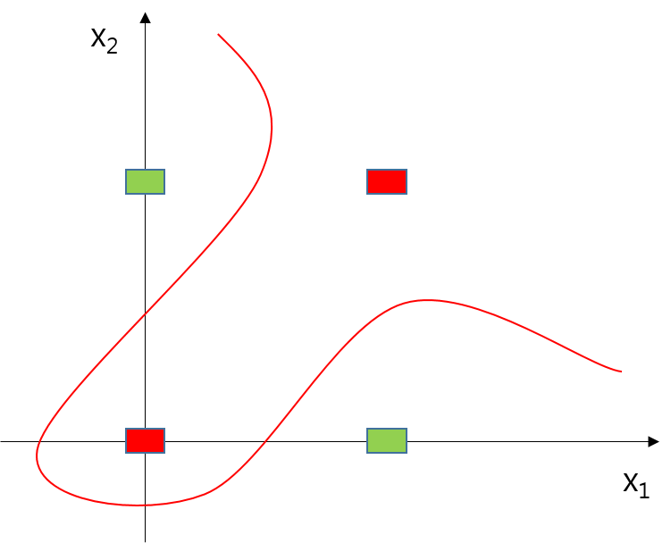

# 2. 퍼셉트론

## 2.1 퍼셉트론이란?

#### 퍼셉트론의 정의

* 다수의 신호를 입력으로 받아 하나의 신호를 출력하는 일종의 인공신경망
* 각 노드의 가중치와 입력치를 곱한 것을 모두 합한 값이 활성함수에 의해 판단함
* 보통 결과 값이 임계치보다 작은지, 큰지의 여부를 기준으로 0또는 1을 출력하는 형태


#### 퍼셉트론의 수식 표현

* 입력으로 2개의 신호를 받는 퍼셉트론을 표현한 예
* 퍼셉트론은 복수의 입력신호에 각각 고유한 가중치를 부여 해 각 신호의 영향력을 조절함
* x : 입력신호, w : 가중치 , y : 출력신호 , θ : 임계값

$$
y=\begin{cases}
 & 0 \:\: ( w_1x_1+w_2x_2 \leq \theta) \\
 & 1 \:\: ( w_1x_1+w_2x_2 > \theta)
\end{cases}
$$


## 2.2 단순한 논리 회로

### 2.2.1 AND 게이트

* 입력이 둘이고 출력이 하나인 형태의 논리 회로

* AND게이트를 만족하는 매개변수 ($$w_1, w_2, \theta$$)의 예

  - (0.5, 0.5, 0.7) , (0.5, 0.5, 0.8), (1.0, 1.0, 1.0) .... 외 다수

  | $$x_1$$ | $$x_2$$ | $$y$$ |
  | :-----: | :-----: | :---: |
  |    0    |    0    |   0   |
  |    1    |    0    |   0   |
  |    0    |    1    |   0   |
  |    1    |    1    |   1   |

  ​


### 2.2.2 NAND 게이트와 OR 게이트

* NAND 게이트는 AND게이트의 출력을 뒤집은 형태

* $$x_1, x_2$$가 모두 1 일때만 0을 출력하고 그 외에는 1을 출력

* NAND 게이트를 만족하는 매개변수 ($$w_1, w_2, \theta$$)의 예

  * (-0.5, -0.5, -0.7) ... 외 ANd게이트의 매개변수의 부호를 반전시킨 것 모두

  | $$x_1$$ | $$x_2$$ | $$y$$ |
  | :-----: | :-----: | :---: |
  |    0    |    0    |   1   |
  |    1    |    0    |   1   |
  |    0    |    1    |   1   |
  |    1    |    1    |   0   |

  ​

* OR 게이트는 입력신호중 하나면 1이라도 충역이 1이되는 회로

* OR 게이트를 만족하는 매개변수 ($$w_1, w_2, \theta$$)의 예

  * (1.0, 1.0, 0.5) , (0.7, 0.7, 0.5), ... 외 다수

  | $$x_1$$ | $$x_2$$ | $$y$$ |
  | :-----: | :-----: | :---: |
  |    0    |    0    |   0   |
  |    1    |    0    |   1   |
  |    0    |    1    |   1   |
  |    1    |    1    |   1   |


## 2.3 퍼셉트론 구현하기

### 2.3.1  간단한 구현부터

* AND 회로를 python 으로 구현 해 보자

  ```python
  def AND(x1, x2):

  	w1, w2, theta = 0.5, 0.5, 0.7
  	tmp = x1*w1 + x2*w2
  	if tmp <= theta:
  		return 0
  	elif tmp > theta:
  		return 1

  print(AND(0, 0)) # 0
  print(AND(1, 0)) # 0
  print(AND(0, 1)) # 0
  print(AND(1, 1)) # 1
  ```


### 2.3.2 가중치와 편향 도입

* 앞서  θ로 표현한 임계값을 -b로 치환하여 식을 수정한다
* 이때 b 를 **편향**(bias) 이라 부르며, 그래프로 표현 할 경우 y절편에 해당한다.
* w 는 동일하게 **가중치**(weight) 라고 부른다
$$
y=\begin{cases}
 & 0 \:\: ( b + w_1x_1+w_2x_2 \leq 0) \\
 & 1 \:\: ( b + w_1x_1+w_2x_2 > 0)
\end{cases}
$$


* 이 때 가중치 $$w_1, w_2$$는 입력신호가 결과에 주는 영향을 조절하는 매개변수이고,
* 편향인 b 는 뉴런이 얼마나 쉽게 활성화 되는지에대한 민감도를 결정한다.
* 다음은 가중치와 편향을 도입한 AND, NAND, OR 게이트 코드이다.

```python
import numpy as np

def AND(x1, x2):
	x = np.array([x1, x2])
	w = np.array([0.5, 0.5])
	b = -0.7

	tmp = np.sum(w*x) + b
	if tmp <= 0:
		return 0
	elif tmp > 0:
		return 1
def NAND(x1, x2):
	x = np.array([x1, x2])
	w = np.array([-0.5, -0.5]) # AND와 가중치(w, b)만 다름
	b = 0.7

	tmp = np.sum(w*x) + b
	if tmp <= 0:
		return 0
	elif tmp > 0:
		return 1

def OR(x1, x2):
	x = np.array([x1, x2])
	w = np.array([0.5, 0.5]) # AND와 가중치(w, b)만 다름
	b = -0.2

	tmp = np.sum(w*x) + b
	if tmp <= 0:
		return 0
	elif tmp > 0:
		return 1
```


## 2.4 퍼셉트론의 한계

### 2.4.1 도전! XOR게이트

* XOR게이트는 배타적 논리합 이라는 회로로 아래와 같이 진리표를 작성할 수 있다.
* 하지만 직선 하나만으로 뉴런이 활성화 되는 영역을 나눌 수 있는 방법은 없다.

| $$x_1$$ | $$x_2$$ | $$y$$ |
| :-----: | :-----: | :---: |
|    0    |    0    |   0   |
|    1    |    0    |   1   |
|    0    |    1    |   1   |
|    1    |    1    |   0   |


### 2.4.2 선형과 비선형

* 직선 이라는 제약을 두지 않으면 아래 그림과 같이 나눌 수 있는 방법이 생긴다.
* 이 때, 직선을 사용하는 영역을 **선형**, 곡선을 사용하는 영역을 **비선형** 이라고 한다.




## 2.5 다층 퍼셉트론이 출동한다면

* 퍼셉트론은 층을 쌓아 **다층 퍼셉트론**(multi-layer perceptron)을 만들 수 있다.
* 여기에서는 층을 하나 더 쌓아 XOR 게이트를 표현해 볼 것이다.


### 2.5.1 기존 게이트 조합하기

* XOR게이트는 AND, NAND, OR 게이트를 조합하여 아래와 같이 구현 할 수 있다.


* XOR 게이트의 진리표는 다음과 같다.
  (위 그림의 A,B,C,D,Q 는 각각 $$x_1, x_2, s_1, s_2, y$$ 에 해당한다.)

| $$x_1$$ | $$x_2$$ | $$s_1$$ | $$s_2$$ | $$y$$ |
| :-----: | :-----: | :-----: | :-----: | :---: |
|    0    |    0    |    1    |    0    |   0   |
|    1    |    0    |    1    |    1    |   1   |
|    0    |    1    |    1    |    1    |   1   |
|    1    |    1    |    0    |    1    |   0   |


### 2.5.2 XOR게이트 구현하기

* 앞서 구현한 AND, NAND, OR 게이트를 조합하여 다음과 같이 구현 할 수 있다.

```python
def XOR(x1, x2):
	s1 = NAND(x1, x2)
	s2 = OR(x1, x2)
	y = AND(s1, s2)
	return y
```

