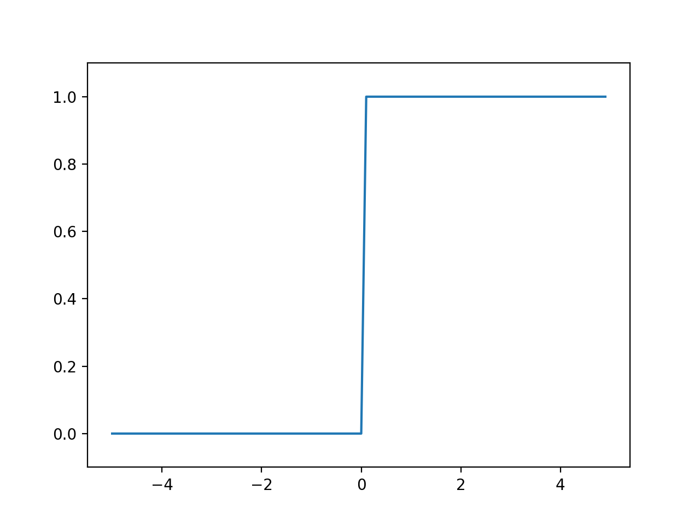
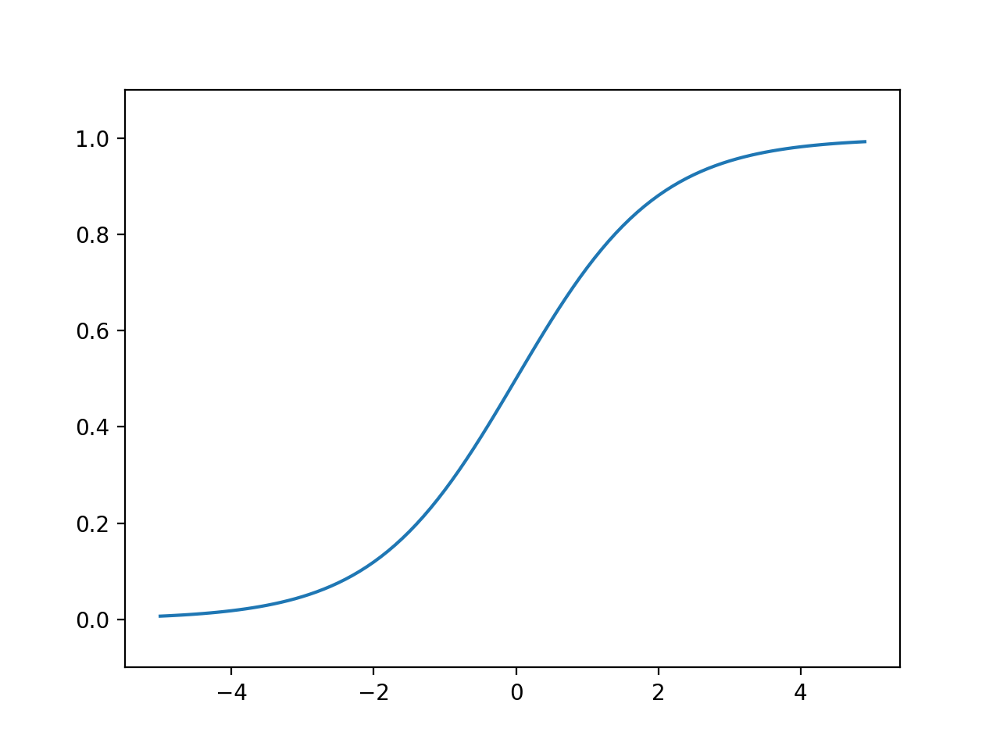
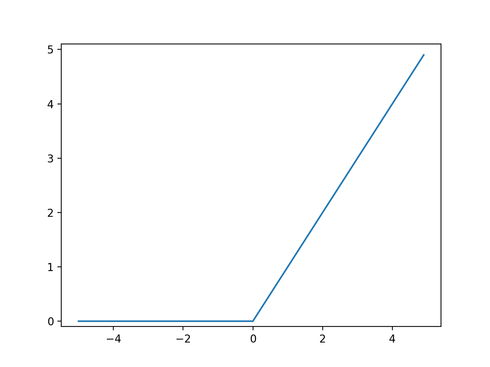

# 3. 신경망

## 3.1 퍼셉트론에서 신경망으로

### 3.1.1  퍼셉트론의 정의
* 신경망을 그림으로 나타내면 아래와 같으며, 가장 왼쪽 줄을 **입력층**, 맨 오른쪽 줄을 **출력층**, 그 사이에 있는 줄을 **은닉층**이라 부른다.
* 은닉층 뉴런은 사람눈에 보이지 않는 계층이다.
* 가중치를 가지는 층은 입력층과 은닉층이므로 아래 그림은 엄밀히 말해 **2층 신경망**의 예에 속한다.


### 3.1.2 퍼셉트론 복습
* 다음은  $$x_1$$ 과 $$x_2$$ 라는 두 신호를 받아 y 를 출력하는 퍼셉트론이다.
* b 는 **편향**을 나타내는 매개변수로, 뉴런이 얼마나 쉽게 활성화되는지를 나타낸다.
* $$w_1$$과  $$w_2$$는 각 신호의 **가중치**로 각 신호의 영향력을 제어한다.

$$
y=\begin{cases}
 & 0 \:\: ( b + w_1x_1+w_2x_2 \leq 0) \\
 & 1 \:\: ( b + w_1x_1+w_2x_2 > 0)
\end{cases}
$$


* 위의 퍼셉트론을 표현한 수식에서, 조건분기의 동작(0을 넘는 경우에만 1을 출력, 그외에 0출력)을
  $$h(x)$$라는 하나의 함수로 표현하면 다음과 같다.
* 이렇게 입력신호의 총 합을 출력신호로 변환하는 함수인 $$h(x)$$와 같은 함수를 **활성함수** 라고 부른다.
* 이 활성함수는 임계값을 경계로 출력이 바뀌는데, 이런 함수를 특별히 **계단함수(step function)**라고 부른다.

$$
y = h(b + w_1x_1+w_2x_2 )\\
h(x)=\begin{cases}
 & 0 \:\: ( x \leq 0) \\
 & 1 \:\: ( x > 0)
\end{cases}
$$


### 3.1.3 활성화 함수의 등장

* 앞선 식은 가중치가 곱해진 입력신호의 총 합을 계산하고, 그 합을 활성화함수를 통해 결과를 내는 2단계로 이루어진다.


* 활성화 함수에 들어가는 가중치가 달린 입력신호와 평향의 총합을 a 라 하면 다음과 같이 나타낼 수 있다.

$$
a= b + w_1x_1+w_2x_2 \\
  y = h(a)
$$

* 아래 그림은 기존 출력값이 있는 **뉴런**의 크기를 키우고, 
* 가중치 신호를 조합한결과를 a라는 **노드**로 표현했으며, 
* 활성화함수를 통과하여 y라는 노드로 변환되는 과정을 나타낸다.


## 3.2 활성화 함수

### 3.2.1 시그모이드 함수

* 다음은 신경망에서 자주 이용하는 **시그모이드 함수(sigmoid function)**를 나타낸 식이다.

$$
h(x) = \frac{1}{1 + e^{-x}}
$$

### 3.2.2 계단함수 구현하기

* 다음은 가장 단순하게 구현한 계단함수 코드이다

``` python
def step_function(x):
    if x > 0:
        return 1
    else: 
    	return 0
```

* 실수 뿐 아니라 numpy의 배열도 지원하는 계단함수는 다음과 같다.
* numpy의 배열을 부등호 현산을 하면 ```bool```배열이 생성되는데, 
  이 배열의 자료형을 변환하기 위해 ```astype```라는 함수를 이용할 수 있다.

``` python
def step_function(x):
    y = x > 0
    return y.astype(np.int)
```


### 3.2.3 계단함수의 그래프

* 다음과 같이 계단함수의 그래프를 그려 볼 수 있다.
* ```np.arrange(-5.0, 5.0, 0.1)```은 -5.0 에서 5.0 까지 0.1 간격으로 numpy 배열을 생성한다.
* 이렇게 0.1 단위로 구한 numpy배열을 matplotlib를 이용하여 그래프를 그린다.


``` python
import numpy as np
import matplotlib.pylab as plt


def step_function(a):
    return np.array(a > 0, dtype=np.int)

x = np.arange(-5.0, 5.0, 0.1)
y = step_function(x)

plt.plot(x, y)
plt.ylim(-0.1, 1.1)  # y축 범위 지정
plt.show()
```




### 3.2.4 시그모이드 함수 구현하기

* ```np.exp(-x)```는 자연로그상수의 지수를 구하는 수식에 해당한다.
* 아래와 같이 시그모이드 함수를 구현해도 numpy배열을 지원 할 수 있다. (numpy의 브로드캐스트 때문)

``` python
import numpy as np
import matplotlib.pylab as plt


def sigmoid_function(a):
    return 1 / (1 + np.exp(-a))

x = np.arange(-5.0, 5.0, 0.1)
y = sigmoid_function(x)

plt.plot(x, y)
plt.ylim(-0.1, 1.1)  # y축 범위 지정
plt.show()
```




### 3.2.5 시그모이드 함수와 계단 함수의 비교

* 시그모이드 함수는 계단함수에 비해 매끄러움이 특징이며, 입력에 따라 출력이 연속으로 변한다.
* 두 함수는 매끄러움의 차이는 있지만, 입력이 클 경우 동일하게 출력이 1에 가까워지고 작을 경우 0에 가까워진다.


### 3.2.6 비선형 함수

* 시그모이드 함수와 계단함수는 둘 다 **비선형 함수**에 속한다.
* 신경망에서는 활성화 함수로 비선형 함수를 사용해야 한다.
  * 선형 함수를 이용할 경우 은닉층이 깊어져도 은닉층이 없는 신경망과 동일한 기능밖에 수행하지 못한다.
  * 선형함수인 $$h(x)=cx$$를 활성화 함수로 사용한 3층 네트워크 의 예를 들어보면,
    식으로 나타낼 경우 $$y(x) = h(h(h(x)))$$가 되고 이는 $$y={c}^{3}x$$와 같아져서 
    결국 계수만 다른 동일한 선형함수로 표현이 되 버린다.
* 따라서, 층을 쌓는 이점을 살리고자 한다면 반드시 활성화 함수로 비선형 함수를 사용해야 한다.


### 3.2.7 ReLU 함수

* 최근 시그모이드 대신에 신경망 분야에서는 **ReLU(Rectified Linear Unit) 함수**를 활성화 함수로 주로 이용하고 있다.
* ReLU함수는 입력이 0을 넘으면 그 입력을 그대로 출력하고 0 이하면 0을 출력하는 함수이다.

$$
h(x)=\begin{cases}
 & x \:\: ( x > 0)\\
 & 0 \:\: ( x \leq 0) 
\end{cases}
$$

```python
def relu(x):
    return np.maximum(0, x)
```




## 3.3 다차원 배열의 계산


### 3.3.1 다차원 배열

* ```np.array```를 이용해 다차원 배열을 한번에 생성 가능
* ```print(A)``` : 배열 A의 모든 원소 출력
* ```np.ndim(A)``` : 배열 A의 차원 출력
* ```A.shape``` : numpy 배열 A의 차원별 원소 갯수, row - col 순으로 표시

```python
A = np.array([ [1,2], [3,4], [5,6] ])
print (A)
np.ndim(A)
A.shape
```


### 3.3.2 행렬의 내적(행렬 곱)

* ``` np.dot(A, B)``` : 행렬 A 와 행렬B의 내적을 구함
* 내적은 연산의 순서가 중요하며, A 의 행의 수와 B의 열의 수가 같아야 연산이 가능 함

``` python
A = np.array([ [2,3,4], [5,6,7] ])
B = np.array([ [1,2], [3,4], [5,6] ])

C = np.dot(A,B)
print(C)
```


### 3.3.3 신경망의 내적

* 행렬의 내적을 이용하여 신경망의 결과를 한번에 구할 수 있다.

$$
\binom{x_1}{x_2} 
\cdot  
\begin{pmatrix} 1 & 3 & 5 \\  2 & 4 & 6 \end{pmatrix}
= 
\begin{pmatrix} y_1 \\ y_2 \\ y_3 \\  \end{pmatrix}
$$

``` python
X = np.array([1,2])
W = np.array([[1,3,5], [2,4,6]])
Y = np.dot(X, W)

print(Y)
```


